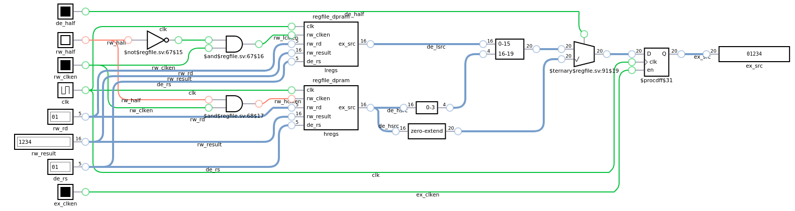

# Sept 8, 2022

Added the [register file](../verilog/cpu/mod/regfile_half.sv).

It took a couple days of wrestling with `cocotb` to get some functioning tests for just the register file alone. At first I tried reaching into the cpu inside the `dut` but that didn't work. Relevant signals were staying `x` which was super confusing. I think `iverilog` was optimizing them away since I didn't have inputs and outputs hooked up fully.

So I switched to putting an instance of the register file directly into the `test_soc` and wiring all of its inputs and outputs to `test_soc`'s inputs and outputs. That worked finally.

As for the register file itself, it comes as just half, and you'd wire two of them together to form a full register file with two read ports.

This is because I am contemplating a semi-discrete build, what I am calling an "exploded FPGA" build. So each part of the computer would be on individual FPGAs. The smallest FPGA I can find is 256 LUTs, and with its distributed RAM, it can only fit half the register file. Hence splitting it into two, so it can be two chips.

The register file half itself is split into two 16-bit banks of registers, one for the lower half of a 32-bit word, and one for the upper half. This allows them to be separately written, and the forwarding works separately for each half as well.

The register file is "write through" so if the register being read is the one being written in that cycle, the value is forwarded with a mux directly to the output.

Here is the [digital.js](https://github.com/tilk/digitaljs) schematic of the register file module:

Here's what the `regfile_dpram` module looks like:

And inside the `dpram` module:

For naming, I am trying to get away with using system verilog's `.*` syntax, so I am trying to keep the names the same for each level of abstraction. We'll see how that ends up in the end.

The prefixes are:

* `rw_` for register write (during writeback)
* `de_` for inputs or internal signals in the decode stage
* `ex_` for inputs to the execute stage, so output register end up having this

There's `xx_clken` signals for the stage's input register clock enables.
