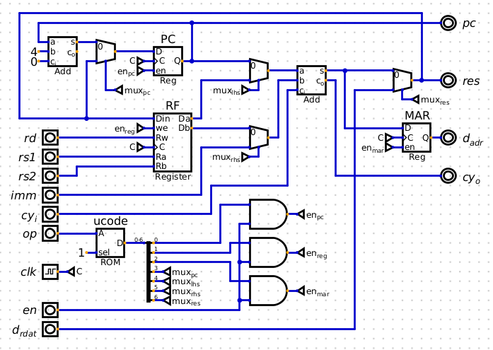
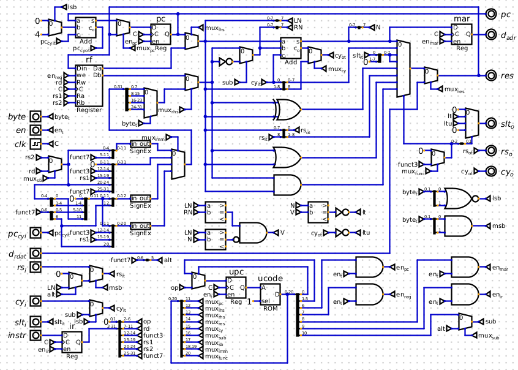
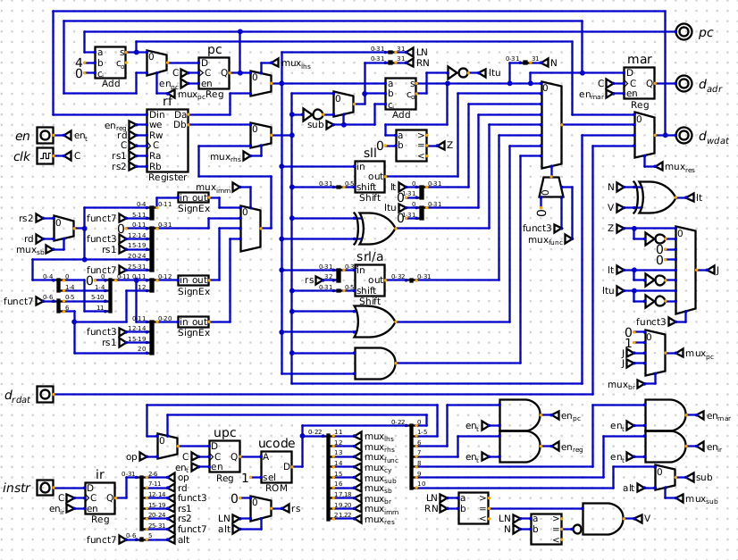
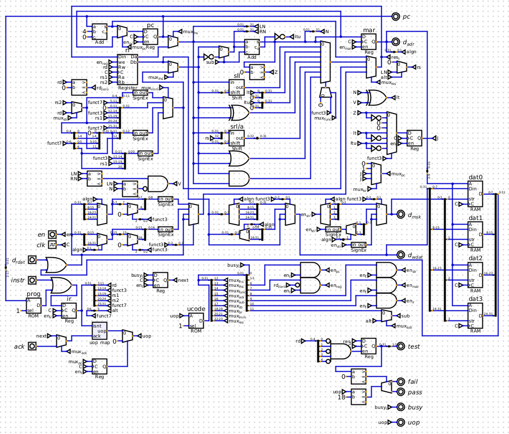

# Sept 26, 2022

A few days ago I sat down and hammered out almost a whole single-cycle design in [Digital](https://github.com/hneemann/Digital) in typical hyperfocus fashion. Some days inspiration just hits me.

The idea started as an idea for a bit slice cpu and I felt like just sketching it out in Digital:

That's the beginnings, with just add being supported, and some beginnings of how to handle addressing memory.

Well one thing lead to another and pretty soon I had a fairly feature rich RISC-V data path slice on my hands. The idea being this could be put on a small FPGA and multiple of them could work together:

The ALU is taking shape and it has all the immediate formats supported, with branches and single bit shifts. This design is not tested and has some bugs. But I thought I would simplify it and just build a 32-bit wide version, dropping the idea of bit-slicing it:

Single bit shifts are dropped for a barrel shifter, as well as dropping all the bit-slice related signals and muxes.

I've never built a cpu without using embedded circuits to hide the complexity before. I can see why people do it. It's oddly satisfying to see all the complexity of it crammed on the screen like this.

On the top left is the fetch unit. Just below that the register file. Below that the muxes for selecting the immediate from the instruction. In the middle the ALU with the result mux on the right, with the branch and compare logic below. At the bottom is the control unit with the register enables and mux select signals. A bit more compare logic is crammed at the bottom.

Obviously this design is not tested and I am still working on it to work and fixing all the things that don't quite work. But I like the general idea and I am going to keep running with it.

Here's the latest version. It's starting to grow some warts as I get each part tested and trying to get the RISC-V test suite running on it:

I will do a clean up pass when it's more functional since it will keep growing new warts as each part gets fixed / elaborated.

The `simple.S` test "passes" (`fence` is just a `nop` and `ecall` just halts with a pass/fail signal). Working on `add.S`, there's a bug with the `lui` instruction, and the calculated branch address is 4 more than it should be.

But I fixed the branch shadow down in the bottom left, and got a multi-cycle branch mostly working.

Multi-cycle? Didn't I say it was single-cycle? Well, yes, in that it's not pipelined (well, except the fetch unit, so I guess it's a 2 stage pipeline). But the rest of the processor is does its computation in a single cycle, except for a few instructions. Branches need to compare first before they can jump. Memory ops will need to calculate the address first before anything can load/store.

The microcode is interesting too, as well as the contents of the `uopmapper` folder, but that will have to wait for the next build update.
