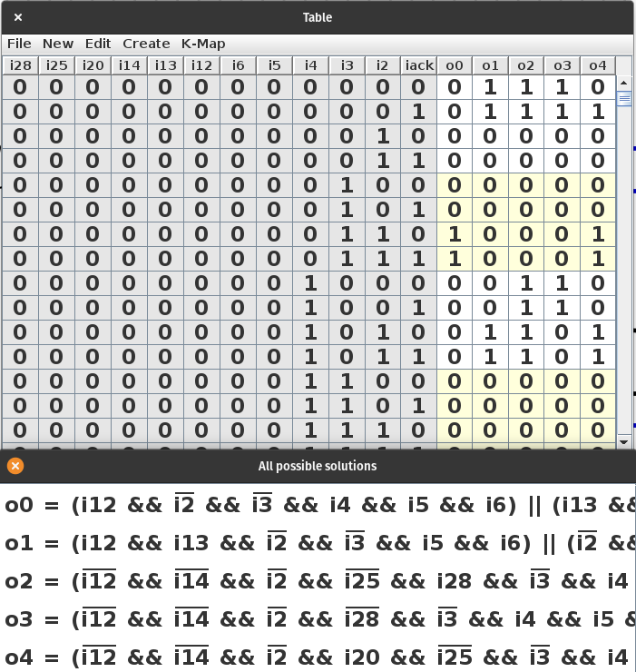

# Oct 1, 2022

Let's talk about the microcode setup for the single-cycle [Digital](https://github.com/hneemann/Digital) version of the processor. I map the instruction bits to a micro-op, and map the micro-op through a microcode ROM into the control bits to control the processor.

Technically microcode isn't needed for a RISC processor, you can build it all using random logic, something like this:


Each instruction is matched with an `and` gate on the left, and each control signal is `or`ed with all the instructions which it's active for. Multi-bit signals end up with a chain of multiplexers `or`ed together.

That doesn't look so bad when there's only two instructions and a couple control signals implemented. But as the number of instructions grows it starts to get unwieldy. The key issue is what if you want to change a control signal or change its semantics. You then need to rework a bunch of circuitry and move things around. It would be a lot faster to do such refactors in a programming text editor, on text. In verilog maybe this is not so much of an issue, but even there, it might be nice to have a higher level abstraction.

So, what if we just use a ROM to replace all the random logic? Well, you would think this would be really bad in an FPGA. But as long as the synthesis tool doesn't decide to put the ROM in a block RAM, and instead implement it as LUTs, it is actually equivalent to the random logic above! That's presuming, of course, that the synthesis tool has good optimization, and I presume they do. Yosys seems to do a pretty good job at any rate.

So, the next hurdle is that some instructions take two cycles and so should take two positions in the ROM, and the way RISC-V instructions are encoded sometimes requires looking at up to 12 instruction bits. If the address on the ROM is 12-bits wide, that will be a huge ROM. It would be nice to keep the ROM 32 entries or smaller.

So what would be nice is to have a mapping between the different instruction bit patterns and a microcode op (aka uop). The uop would be the index into the microcode ROM, which stores the control signals.

So, I built a spreadsheet with all the instruction bit patterns for each instruction:


Blank spaces are "don't care"s. If there's a `1` or `0` then those are expected if there's a match. For RISC-V rv32i, bits `0` and `1` of the instruction should always be 1, so those are handled separately.

This was then [exported to CSV](https://github.com/rj45/rjsc5/tree/5dd1c2ac8843b9eb5cb20d636cbd52dea50f1ff8/microcode/opcodes.csv), and then run through a [Go script](https://github.com/rj45/rjsc5/tree/5dd1c2ac8843b9eb5cb20d636cbd52dea50f1ff8/uopmapper/uopmapper.go) to convert it into a [truth table CSV](https://github.com/rj45/rjsc5/tree/5dd1c2ac8843b9eb5cb20d636cbd52dea50f1ff8/microcode/opmatches.csv).

This truth table CSV can be imported into Digital by clicking `Analysis` then `Synthesis` then `File | Open` and changing the file type to `CSV` and selecting the file. You get something like this:



You can then click `Create | Circuit` and you get a crazy circuit like this:


You can then save that circuit and use it. Note that Digital has a limit of 12 input signals for circuit synthesis, which is why I handle instruction bits 0 and 1 separately.


This very same technique could be used to map directly from the instruction bit patterns to the control signals and cut the control ROM out of the equation, but regenerating the circuit every time the microcode changes is a major pain. It could be done as an optimization once the microcode has stabilized and is unlikely to change anymore. But I would rather let FPGA synthesis tools do this for me.

Another advantage to mapping instruction bits to a micro-op is the ability to save a few pipeline register bits if the design was pipelined. Decoding the micro-op can be distributed into each pipeline stage rather than decoding it all in the decode stage. If you happen to be wanting to build a discrete version, or an "exploded FPGA" version, this can also save on pins / control bus lines.

So then, how is the microcode rom generated? Well, by using [customasm](https://github.com/hlorenzi/customasm) which is a customizable assembler. This can allow the [assembly code](https://github.com/rj45/rjsc5/tree/5dd1c2ac8843b9eb5cb20d636cbd52dea50f1ff8/microcode/microcode.asm) to be converted into control signals stored in the ROM.

The control signals are defined near the top, with a nice human readable name for each, for example:

```asm
; register enables
EN_PC = 1 << 6
EN_REG = 1 << 7
EN_STR = 1 << 8
EN_MEM = 1 << 9
EN_IR = 1 << 10

COMPARE = 1 << 11

; mux_addr
ADDR_PC = 0 << 12
ADDR_RS1 = 1 << 12

; mux_rhs
ALU_RS2 = 0 << 13
ALU_IMM = 1 << 13
```

Then each instruction ends up being an `or` of each relevant signal. It's important that the default of each signal be something equivalent to "do nothing" so that it can be left off of uop definitions that don't care about that control signal. Here are some examples:

```asm
branch:  ; 10: 01010
done ADDR_PC | ALU_RS2 | IMM_B | SB_RD | FUNC_ADD | SUB_UCODE | COMPARE | BR_BRANCH

jal:     ; 11: 01011
done EN_REG | RES_PC | ADDR_PC | IMM_J | BR_JUMP

jalr:    ; 12: 01100
done EN_REG | RES_PC | ADDR_RS1 | IMM_I | BR_JUMP

lui:     ; 13: 01101
done EN_REG | RES_IMM | IMM_U
```

The each microcode op will be a line in the assembly file. The label (`branch`, `jal`, etc) is just for documentation purposes, though if you wanted to you could have jumps and loops in your microcode. See [rj32](https://github.com/rj45/rj32) for an example of a more complex microcode with branches and loops, including a [youtube video detailing the microcode implementation](https://youtu.be/WBe4WEOjlK8).

The first word, the instruction if you will, is an arbitrary name. In this case I am using `done` to indicate a micro-op that fetches the next instruction, and `next` for a micro-op that doesn't fetch. They are defined in a `#ruledef` block:

```asm
#ruledef {
  next {value} => le((value | BUSY )`32)
  done {value} => le((value | READY | EN_PC | EN_IR )`32)
}
```

Another configuration piece is to specify how big the resulting ROM will be using a bank configuration. The `#size` parameter can be adjusted for how many address bits your rom has. The remaining space will be filled with zeros:

```asm
#bankdef bank
{
    #addr 0
    #size 1<<5
    #outp 0
    #fill
}
```

And finally, here is a screenshot of the relevant portion of the processor with the microcode ROM and the mapping circuit:


I am using a splitter to break apart the various control signals, and register clock enable control signals are `and`ed with the processor enable signal to allow it to be stalled.

And that's a lengthy description of how the microcode is set up. The instruction is mapped to a micro-op, microcode is assembled by a customizable assembler into a microcode ROM, and the ROM is used to map from micro-ops into control signals.
