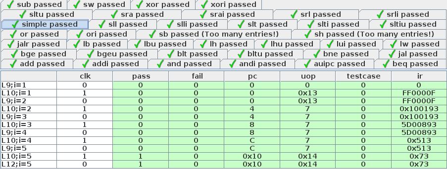

# Oct 2, 2022

Getting [Digital](https://github.com/hneemann/Digital) to run assembly test programs is more than a little bit tricky. Here I detail the best way I have found, so far, to do this.

The [RISC-V test suite](https://github.com/riscv-software-src/riscv-tests) has a collection of test programs, written in assembly, for testing each instruction ([which I ported into this repo](https://github.com/rj45/rjsc5/tree/5dd1c2ac8843b9eb5cb20d636cbd52dea50f1ff8/tests/)). There's also a [much more comprehensive test suite](https://github.com/riscv-non-isa/riscv-arch-test/tree/main/riscv-test-suite) which I may switch to using, though the programs are longer which may cause problems in Digital. I suppose I could split them up into multiple programs.

Running test programs is a good way to test that each instruction works properly. They can be a bit tricky to bootstrap if you don't implement enough instructions, but once you do, it can be a good way to verify the hardware works correctly, even inside an FPGA.

Digital has a test language built in ([documentation](https://github.com/hneemann/Digital/releases/latest)), which is geared more at unit testing individual circuits rather than integration testing a whole CPU. But it can be bent into working.

A key is the `program()` directive, which will replace the contents of a memory which has the `Program Memory` checkbox checked in its `Advanced` settings.

This directive takes a list of data values starting from address zero, for example:

```
program(0x0ff0000f, 0x00100193, 0x05d00893, 0x00000513, 0x00000073, 0xc0001073)
```

You can use a script to load a binary or hex file to generate the `program()` statement for you. There's an [example ruby script](https://github.com/rj45/rjsc5/tree/5dd1c2ac8843b9eb5cb20d636cbd52dea50f1ff8/scripts/digtestgen.rb) in this repo, which will generate the whole test case.

The template it uses is as follows:

```
clk pass fail pc uop testcase ir

# #{filename}
program(#{machine_code.join(", ")})

let i = 0;
while(!(pass | fail | (i >= 2000)))
  let i = i + 1;
  0 0 0 x x x x
  1 x x x x x x
end while
0 1 0 x x x x
```

The first line in Digital's test language is the list of input and output pins to control/observe in the test. In this case I only really care about the `clk`, `pass` and `fail` signals, but I include other signals for debugging purposes and use `x` in the test to indicate I don't care about the value.

The interesting bit is the `while` loop. It's not known how many cycles the test may run. It might have loops in it, so even counting memory addresses won't get you there. So `while` the `pass` and `fail` signals are low, and the number of cycles is less than or equal to `2000`, it will cycle the `clk` line.

The lines that look like a list of numbers and `x`s are stimulus + assertion lines. The order of the fields is the same as the header of the test case. So in this case it's toggling `clk` between `0` and `1`, and asserting `pass` and `fail` are `0` and not caring about the other signals with an `x`.

The `x`s for `pass` and `fail` on the last line of the `while` loop make sure the loop exits cleanly.

On the final line, once the `while` loop exits, the `pass` signal is asserted to be `1` and `fail` is asserted to be `0`.

This results in test cases that look like this:



I usually put all the test programs into `test` components in a [top level test circuit](../dig/testbench.dig), which ends up looking like this:


Then in my main circuit, I have a bit of circuitry dedicated to driving the `pass` and `fail` signals when the test ends:


The key is to ensure that the `pass` and `fail` outputs only go high at the end of the test, and only one of them goes high to indicate the test passed or failed. The other signals are debugging signals. One of the registers ends up containing the number of the test case that failed, so that is send out to the `testcase` output to speed up debugging.

Updating the test cases can be tedious, so there's a [ruby script](../scripts/updatetests.rb) to load the XML of the Digital circuit with all the test program and replace all the test programs in it with a freshly compiled copy. This is handy if your instruction encoding changes, or you change your test programs, and can save quite a lot of time.

An annoying limitation is that test cases can only have up to 1024 entries (512 clock cycles) before being truncated and a "too many entries" warning appearing. Hence my comment above about splitting the more comprehensive test programs into a series of smaller ones. But this just produces a warning and it does execute the whole test. So for now I just ignore it.

So there you have it, a way to run a suite of test programs in Digital.
